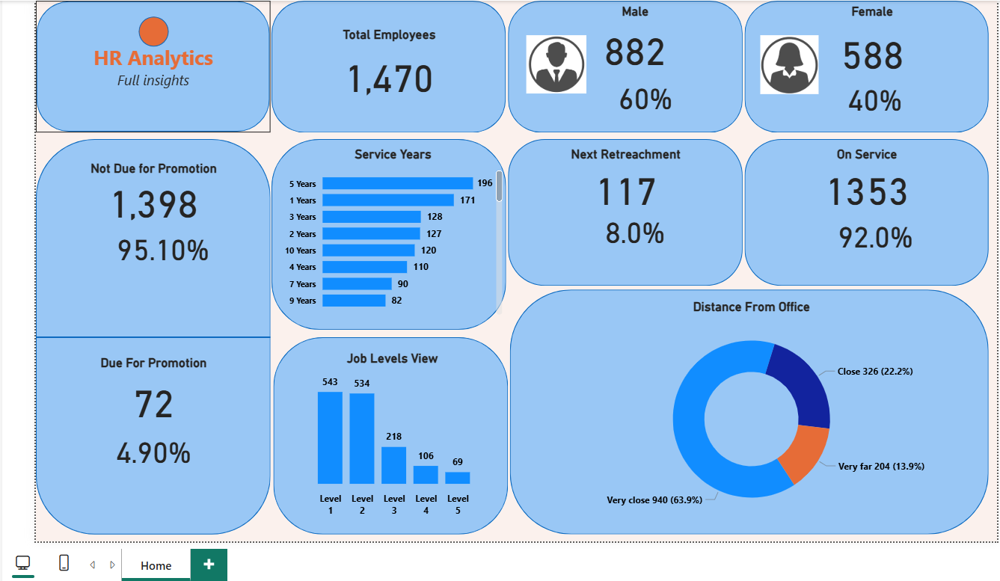

# 👔 HR Analytics Dashboard — Power BI

### 🧾 Executive Summary
The **HR Analytics Dashboard** provides actionable insights into workforce performance, diversity, and retention.  
By analyzing employee demographics, promotion readiness, and attrition patterns, this report helps HR leaders make informed, data-driven talent decisions.

---

### 🎯 Business Objectives
- Identify employees due for promotion or at risk of attrition  
- Understand workforce diversity and experience distribution  
- Track department-level performance and job satisfaction trends  
- Support HR strategy with real-time visual insights  

---

### 📊 Key Insights & Metrics
| Metric | Description |
|--------|--------------|
| **Total Employees** | Total number of active employees analyzed |
| **Attrition Rate** | Percentage of employees who left the company |
| **Average Age & Experience** | Average tenure and age distribution |
| **Promotion Readiness** | Employees eligible based on tenure and rating |
| **Department Breakdown** | Gender, satisfaction, and performance by department |
| **Job Level Trends** | Experience and promotion patterns |

---

### 🧩 Dashboard Views

#### 📍 Overview Page
- Company-wide KPIs and retention insights  
- Attrition vs active employees by department  
- Workforce distribution by age and experience  

#### 🎓 Promotion & Performance Page
- Promotion eligibility matrix  
- Rating vs Tenure heatmap  
- Departmental performance and satisfaction trends  

#### 👥 Demographics Page
- Gender diversity visualization  
- Department-wise employee count  
- Average service years and commute distance  

---

### 🛠️ Tools & Technologies
| Tool | Purpose |
|------|----------|
| **Power BI Desktop** | Dashboard creation and visualization |
| **Power Query** | Data cleaning and transformation |
| **DAX (Data Analysis Expressions)** | Custom KPIs and calculated measures |
| **CSV Dataset** | HR employee data source |
| **Git & GitHub** | Version control and project sharing |

---

### 🧮 Data Model Overview
- **Dataset Used:** `HR Analytics Data.csv`  
- **Fact Table:** Employee Records  
- **Key Fields:** Age, Department, Job Level, Distance from Home, Attrition, Rating  
- **Relationships:** Built between employee demographics, job role, and satisfaction metrics for interactive analysis.  

---

### 📂 Repository Structure

HR-Analytics-Dashboard-PowerBI/
│
├── hr-analytics.pbix
├── HR Analytics Data.csv
├── dashboard-overview.png
├── README.md
├── LICENSE
└── .gitignore

---

### 🖼️ Dashboard Preview

---

### ⚙️ Usage Instructions
1. Download the `hr-analytics.pbix` file.  
2. Open it in **Power BI Desktop** (latest version recommended).  
3. Load the dataset `HR Analytics Data.csv` (keep both files in the same folder).  
4. Explore the dashboard pages and apply filters such as Department, Gender, or Job Role.  

---

### 📈 Skills Demonstrated
- Power BI dashboard storytelling and design  
- Data transformation using Power Query  
- DAX for KPI calculations  
- Employee performance and attrition analytics  
- Interactive filtering and drill-through functionality  
- Version control using Git & GitHub  

---

### 🚀 Future Enhancements
- Integrate predictive attrition analysis using Python or Power BI Service  
- Connect live HR databases for scheduled data refresh  
- Build a “Retention Score” metric combining satisfaction and performance  

---

### 👨‍💻 Author
**Harsh Arora**  
Data Analyst | Power BI Developer  
📧 [kartikarora328@gmail.com]  
🔗 [LinkedIn](https://www.linkedin.com/in/harsh-arora-80445167)

---

### 📜 License
This project is licensed under the **MIT License** — see the [LICENSE](LICENSE) file for details.

---

### 🔖 Metadata Summary
| Field | Details |
|--------|----------|
| **Project** | HR Analytics Dashboard |
| **Author** | Harsh Arora |
| **Created** | November 2025 |
| **Tool** | Microsoft Power BI |
| **Category** | HR Data Visualization |
| **License** | MIT |
| **Dataset Source** | HR Analytics Employee Dataset (sample) |
| **Status** | Completed |
